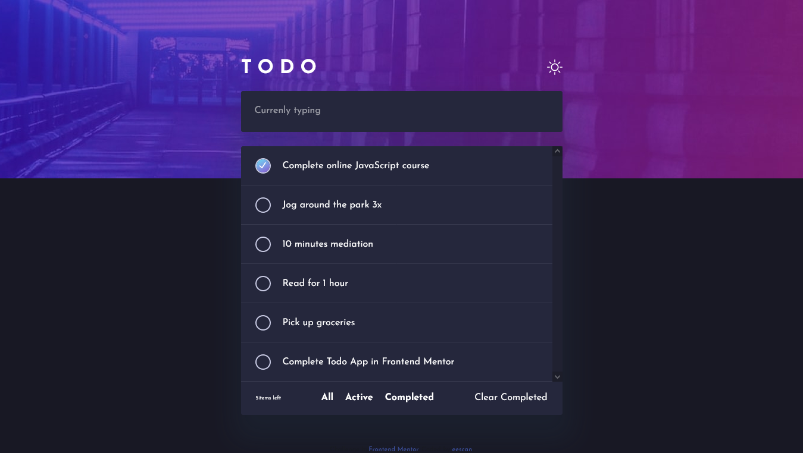
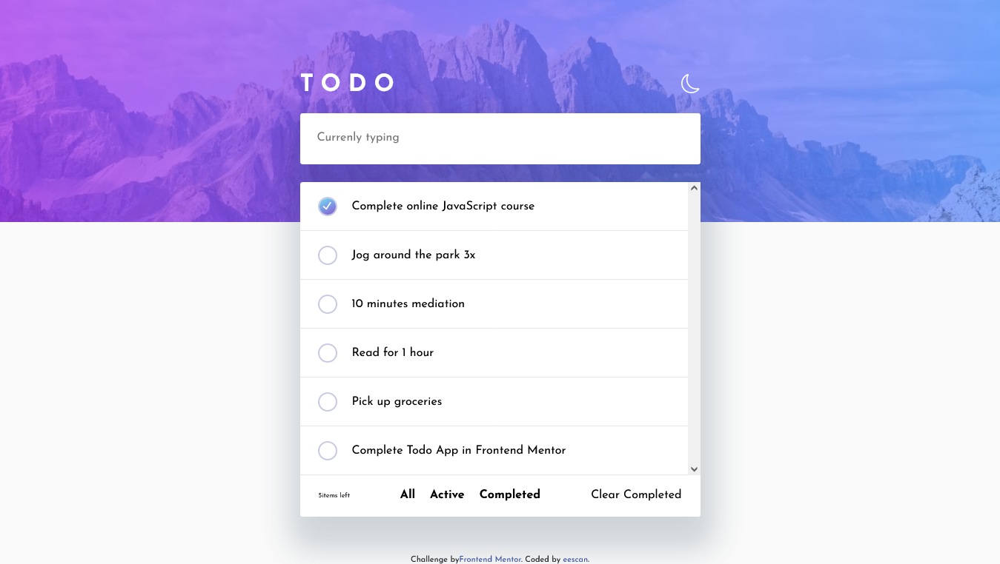

# Frontend Mentor - Todo app solution

This is a solution to the [Todo app challenge on Frontend Mentor](https://www.frontendmentor.io/challenges/todo-app-Su1_KokOW). Frontend Mentor challenges help you improve your coding skills by building realistic projects.

## Table of contents

-   [Overview](#overview)
    -   [The challenge](#the-challenge)
    -   [Screenshot](#screenshot)
    -   [Links](#links)
-   [My process](#my-process)
    -   [Built with](#built-with)
    -   [Continued development](#continued-development)
    -   [Useful resources](#useful-resources)
-   [Author](#author)

## Overview

### The challenge

Users should be able to:

-   View the optimal layout for the app depending on their device's screen size
-   See hover states for all interactive elements on the page
-   Add new todos to the list
-   Mark todos as complete
-   Delete todos from the list
-   Filter by all/active/complete todos
-   Clear all completed todos
-   Toggle light and dark mode
-   **Bonus**: Drag and drop to reorder items on the list

### Screenshot

### Links

-   Solution URL: [github](https://github.com/iskandar13abdurakhmonov/frontend-mentor-todo-app)
-   Live Site URL: [netlify live server](https://main--musical-otter-193176.netlify.app/)

## My process

### Built with

-   Semantic HTML5 markup
-   BEM methodology
-   CSS custom properties
-   Flexbox
-   Desktop-only workflow
-   [React](https://reactjs.org/) - JS library

### Continued development

Next step is make responsive design

### Useful resources

-   [A Complete Guide to Implementing Dark Mode in React](https://betterprogramming.pub/a-complete-guide-to-implementing-dark-mode-in-react-47af893b22eb) - This helped me for making light and dark mode. I really liked this pattern and will use it going forward.
-   [react-custom-checkbox](https://www.npmjs.com/package/react-custom-checkbox) - This is an amazing UI Api which helped me to import custom checkboxes. I'd recommend it to anyone who wants to use custom checkboxes.

## Author

-   Frontend Mentor - [@eescan](https://www.frontendmentor.io/profile/eescan)
-   Twitter - [@ab65485](https://www.twitter.com/@ab65485)
